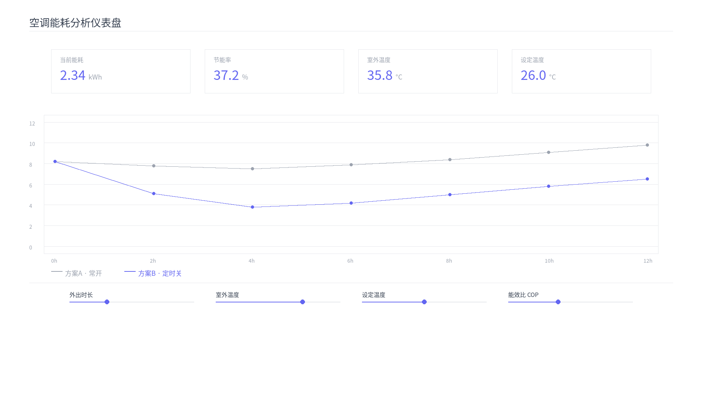
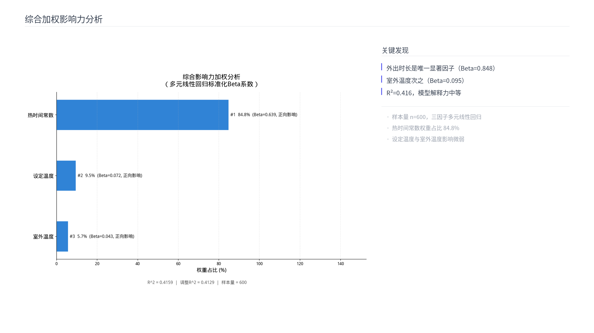
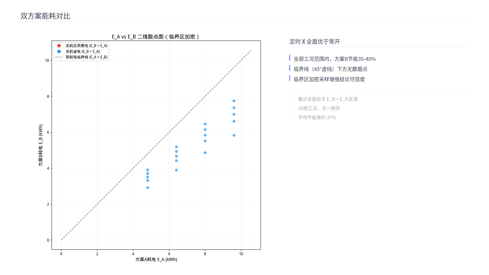
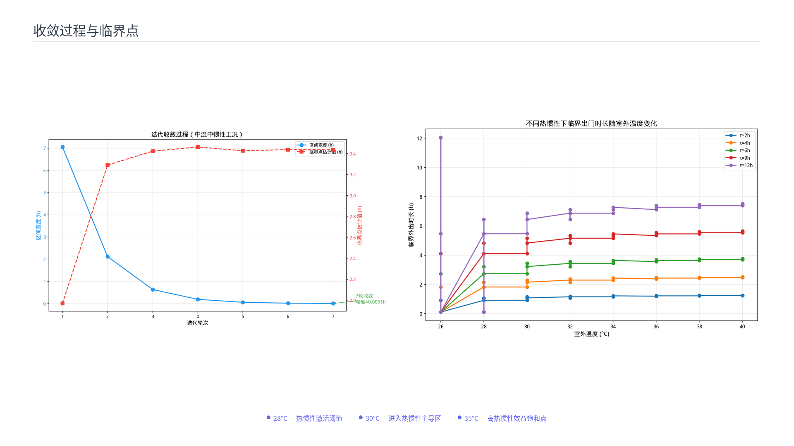
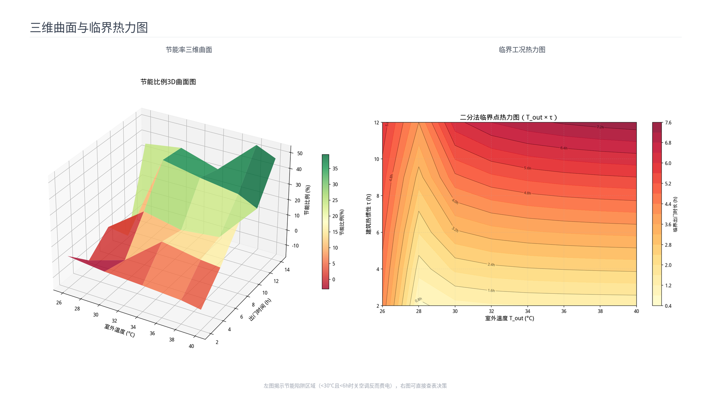

# 空调常开还是定时关更省电？

基于田口方法的空调能耗优化研究 —— 牛顿冷却定律 + 正交实验 + Python仿真。

## 作品渲染

| 交互式仪表盘 | 综合加权影响力分析 | 双方案能耗对比 |
|:---:|:---:|:---:|
|  |  |  |

| 收敛过程与临界点 | 三维曲面与临界热力图 |
|:---:|:---:|
|  |  |

## 工作流

1. **理论建模** — 牛顿冷却定律 + COP衰减 + 14条公式推导
2. **田口正交实验** — L25/L50正交表 + 5因子参数空间扫描
3. **仿真引擎** — Python热力学仿真 + 双方案能耗对比
4. **多维可视化** — 30+张分析图表（3D曲面/热力图/敏感性分析）
5. **综合报告** — PPT + Excel + 交互仪表盘 + 学术版

## 核心结论

- **外出时长是唯一显著因子**（Beta=0.848，解释84.8%方差）
- **28°C 是热惯性激活阈值** — 低于此温度建筑自身保温已足够
- **高温长时场景(>34°C, >8h)关空调可节能 45-55%**
- **短暂外出(<30分钟)不应关机** — 重启能耗大于维持能耗

## 技术栈

`Python` `NumPy` `SciPy` `Matplotlib` `Plotly` `Taguchi` `ANOVA` `田口方法`
