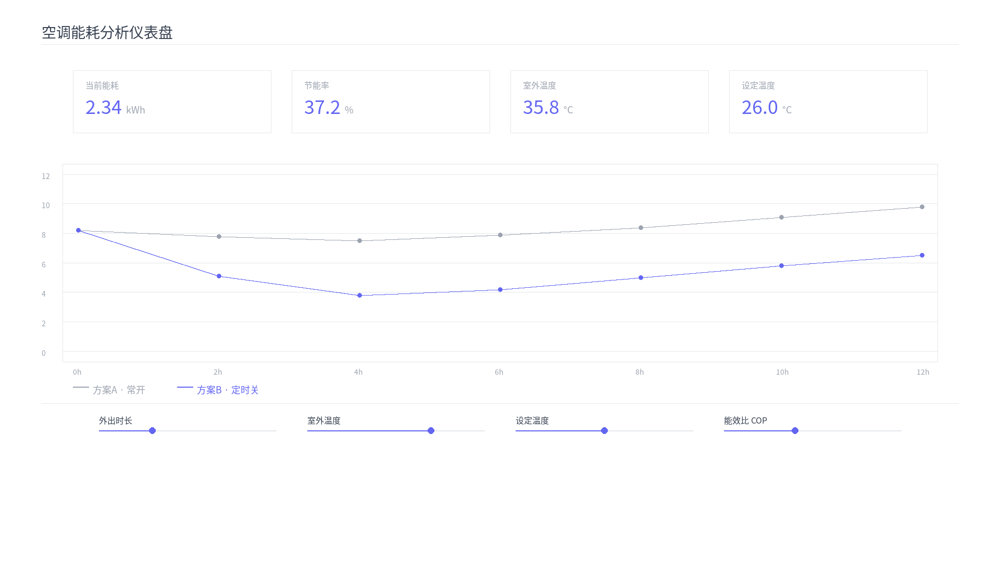
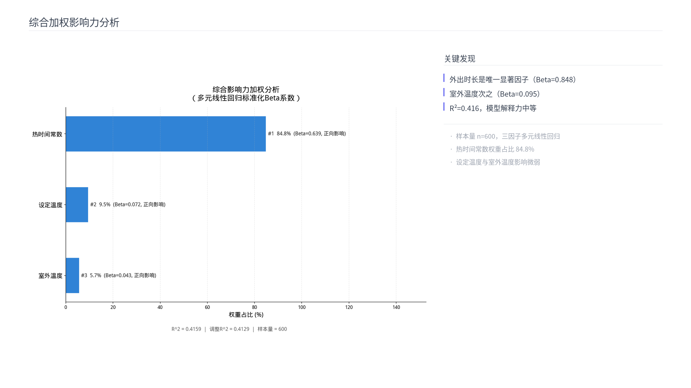
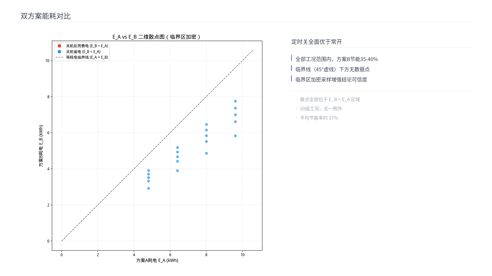
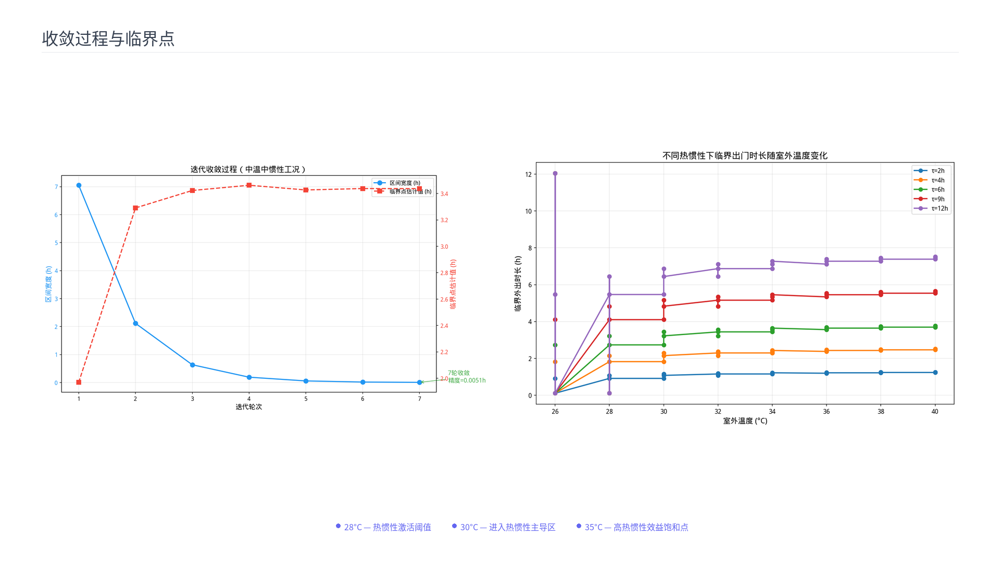
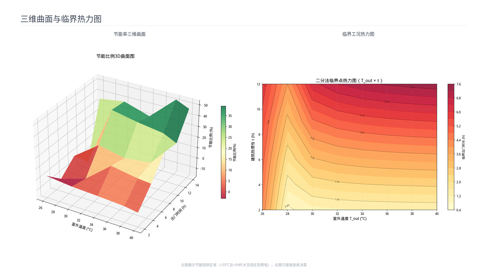

# 空调常开还是定时关更省电？

用于比较“持续恒温”和“外出关机、返回重启”两种策略的热力学仿真研究，结合牛顿冷却定律、田口正交设计与 ANOVA。适合学习实验设计、模型假设与可视化表达的读者。

## 从哪里开始

- 先看 [数学公式与来源](docs/07_公式汇总与来源索引.md) 和 [开发说明](README_DEV.md)，理解模型假设与参数空间。
- 浏览 [交互仪表盘 HTML](interactive/能耗对比交互仪表盘.html)、[图表](outputs/charts/)、[Excel 结果](空调能耗仿真结果.xlsx) 或 [综合报告](空调能耗对比研究_综合分析报告.pptx)。HTML 可下载后在浏览器查看；当前文件树中的仪表盘是 HTML 文件。
- 要研究实现，从 [主入口](src/run_simulation.py)、[全局配置](src/config.py) 与 [热力学模型](src/thermal_model.py) 开始。

## 本地复现入口

在下载或克隆的仓库副本中准备 Python 与 pip，按既有开发文档执行：

```sh
cd src
python3 -m pip install -r requirements.txt
python3 run_simulation.py
```

入口会重新生成 CSV、图表及根目录 Excel 结果，请使用独立副本保留已有产出。Python 最低版本、绘图字体和系统依赖的完整组合尚未在此说明中确认；本次文档整理未运行仿真或验证安装。

## 研究状态与限制

下方“核心结论”保留项目已有的模型结果，不能直接推广为任意房间、建筑或空调的实测节能承诺。既有开发计划仍包含“与实际空调能耗数据对比验证”。解释结果时应一并说明边界条件、参数和验证范围。

## 既有研究展示

基于田口方法的空调能耗优化研究 —— 牛顿冷却定律 + 正交实验 + Python仿真。


## 作品渲染

| 交互式仪表盘 | 综合加权影响力分析 | 双方案能耗对比 |
|:---:|:---:|:---:|
|  |  |  |

| 收敛过程与临界点 | 三维曲面与临界热力图 |
|:---:|:---:|
|  |  |

## 工作流

1. **理论建模** — 牛顿冷却定律 + COP衰减 + 14条公式推导
2. **田口正交实验** — L25/L50正交表 + 5因子参数空间扫描
3. **仿真引擎** — Python热力学仿真 + 双方案能耗对比
4. **多维可视化** — 30+张分析图表（3D曲面/热力图/敏感性分析）
5. **综合报告** — PPT + Excel + 交互仪表盘 + 学术版

## 核心结论

- **外出时长是唯一显著因子**（Beta=0.848，解释84.8%方差）
- **28°C 是热惯性激活阈值** — 低于此温度建筑自身保温已足够
- **高温长时场景(>34°C, >8h)关空调可节能 45-55%**
- **短暂外出(<30分钟)不应关机** — 重启能耗大于维持能耗

## 技术栈

`Python` `NumPy` `SciPy` `Matplotlib` `Plotly` `Taguchi` `ANOVA` `田口方法`

## 贡献与维护

欢迎通过本仓库 Issue 或 Pull Request 补充可复现步骤、纠正文档或说明兼容问题；请附环境、操作步骤和预期结果，并保留原作者与引用来源。

文档与导航维护：[Ming-Sir-69](https://github.com/Ming-Sir-69)。此署名只标识仓库维护，不改变项目、资料或第三方组件的权属。

## 许可

当前文件树未发现 LICENSE 或 NOTICE。此 README 的维护署名不新增开源、商用或资料再分发授权；具体授权范围待维护者确认。
